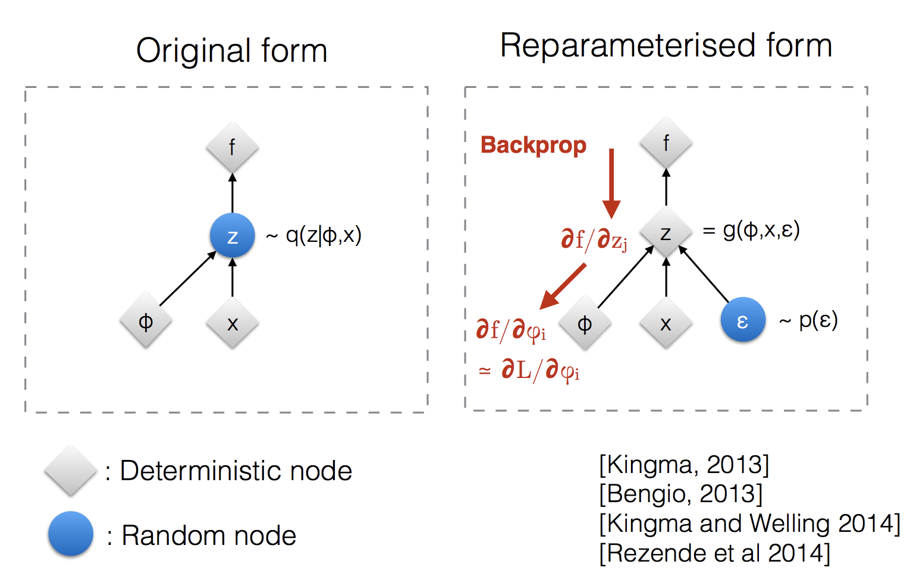

# Gumbel-Softmax VAE

The Gumbel-Softmax VAE uses the Gumbel-Softmax distribution (also known as the Concrete distribution) to allow for backpropagation through categorical latent variables.

## 🏗️ Architecture Diagram

## 🔑 Key Features
- **Categorical Reparameterization:** Provides a continuous relaxation of discrete random variables.
- **Differentiable Sampling:** Allows the model to make discrete choices while remaining fully end-to-end trainable via standard SGD.
- **Flexible Latent Space:** Ideal for tasks requiring categorical decisions, such as architecture search or language modeling.

## 📝 Research Paper
*   [Categorical Reparameterization with Gumbel-Softmax (Jang et al., 2016)](https://arxiv.org/abs/1611.01144)

---
[⬅️ Back to README](../README.md)
