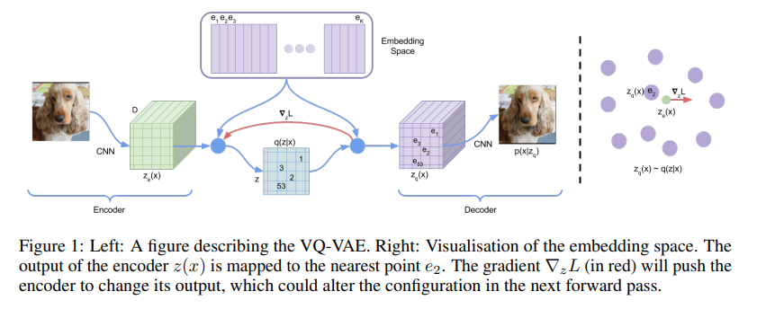

# VQ-VAE (Vector Quantized Variational Autoencoder)

VQ-VAE is a type of variational autoencoder that uses a discrete latent space rather than a continuous one. This is achieved through a technique called vector quantization.

## 🏗️ Architecture Diagram

## 🔑 Key Features
- **Discrete Latent Space:** Maps continuous outputs from the encoder to the nearest vector in a learned codebook.
- **No Posterior Collapse:** By using discrete representations, it avoids the common "posterior collapse" issue in standard VAEs.
- **High-Fidelity Generation:** Excellent for compressing data into tokens, often used as the first stage for models like DALL-E and AudioLM.

## 📝 Research Paper
*   [Neural Discrete Representation Learning (van den Oord et al., 2017)](https://arxiv.org/abs/1711.00937)

---
[⬅️ Back to README](../README.md)
